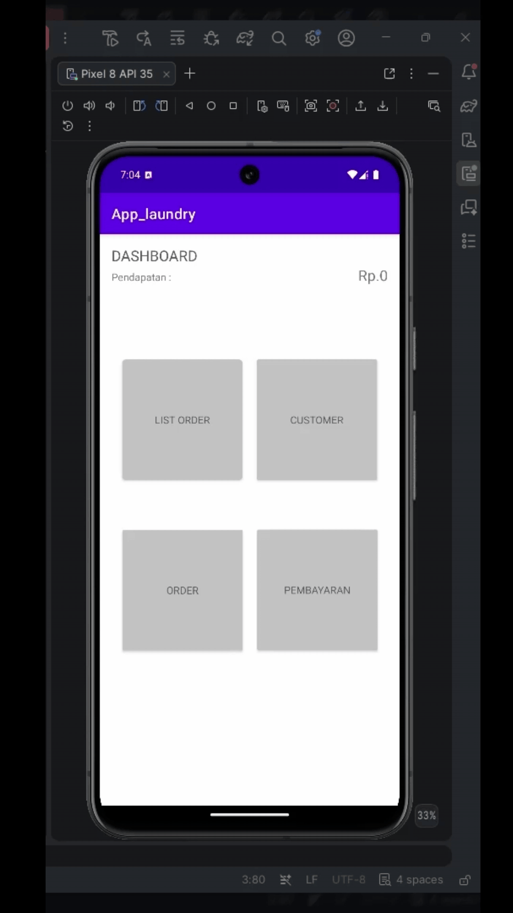

# Kasir Laundry App Mobile

## 📖 About
Kasir Laundry App Mobile is one of my first learning projects in Kotlin and mobile application development, developed as part of an internship assignment.

The application was designed to help laundry business owners manage incoming and completed laundry orders more efficiently. Instead of recording transactions manually, the application provides a simple mobile-based system for recording customer information, managing laundry orders, viewing order history, and calculating total gross revenue.

## ✨ Features
* 👤 Customer name management
* 🧺 Add and manage laundry orders
* 💰 Calculate and monitor gross revenue
* 📋 View order history
* 📱 Mobile-based interface

## 🛠️ Tech Stack
|Category |	Technology |
| ------- | ---------- |
|Language	| Kotlin |
|Database	| SQLite |
|Platform	| Android |
